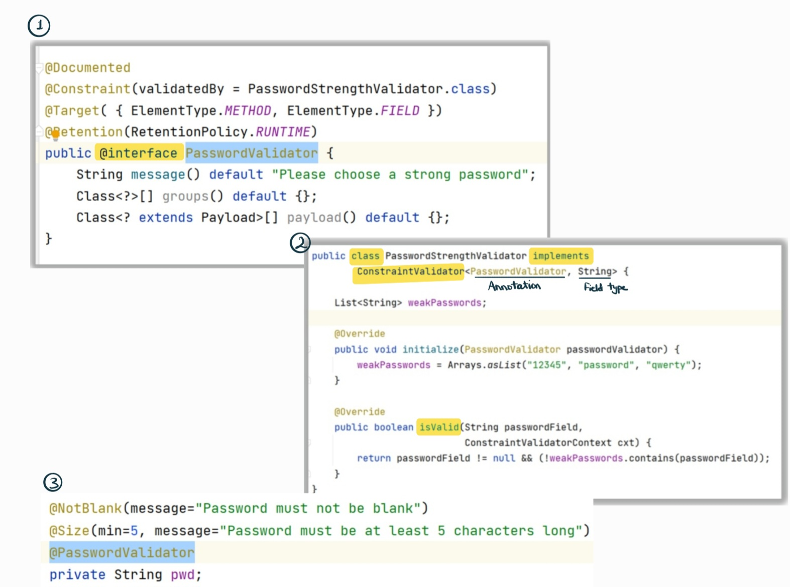

# 📘 Spring Boot, JPA & Hibernate - Zero to Mastery (Course Practice)

This repository contains my practice code and mini projects from the Udemy course:  
**[Spring, Spring Boot, Spring Data JPA & Hibernate - Zero to Mastery](https://www.udemy.com/course/spring-springboot-jpa-hibernate-zero-to-master/?kw=master+spring+6&src=sac&couponCode=LETSLEARNNOW)**

## 🚀 What I'm Learning

- Core Spring Framework concepts
- Spring Boot auto-configuration and structure
- Dependency Injection and Inversion of Control (IoC)
- Spring Data JPA and Hibernate ORM
- Entity relationships (OneToOne, OneToMany, ManyToMany)
- Query methods and JPQL
- Transactions, EntityManager, and repositories
---

# **Core Spring Framework concepts:**
# **• Spring Core:** 
 - The :heart: of the entire spring. <br />
 - Contains Base framework classes, principles and mechanisms. <br />
 - Spring framework and other projects are built on top of "Spring Core". <br />
 - Contains importent components:  <br />
 1. ```IOC``` (Inversion of control): [Principal/Concept] &rarr; A software design concept where the control of object creation and their dependency management is inverted from the program (developer) to a framework/container. <br />
 2. ```DI``` (Dependency Injection): [Implementation Pattern] &rarr; Design pattern used to implement IoC by allowing the injection of a class's dependencies from outside (by the IoC container) rather than the class creating them itself. <br />
 3. ```Beans``` : - Normal Object/ POJO (plain old java object) &rarr; Created and managed by "IOC Container". <br />
 - Defined using config. metadata (XML Config or Annotation). <br />
 4. ```IOC Container```: [Spring Factory] &rarr; Container that: 1- creates beans 2- Manage their lifecycle 3- Injects dependency (via DI). <br />
   - Types: <br />
   1- ```Bean Factory``` &rarr; Lazy initialization. <br />
   2- ```Application Context``` &rarr; More advanced (used is most spring apps). <br />
 5. ```Context ``` (Application Context) : [Spring Brain] &rarr; advance version of IOC Container. <br />
   - Extra features: International support, Event propagation, AOP integration, Easier access to environ./ config. <br />
 6. ```SpEl ``` (Spring Expression Language): Let you write small expressions inside annotations or XML to (Access Values/ Call Methods/ do math). <br />
   ``` @Value("#{2 + 3}") ``` or ```@Value("#{myBean.someMethod()}") ``` &rarr; ```#``` is used to reference beans, methods, or expressions. <br />
  ``` @Value("${app.name}")```  &rarr; ``` $``` Gets value from application.properties. <br />

___

 # **:electric_plug: Spring Data (From JDBC to Spring Data JPA):**
```✅ Persistence Layer``` &rarr; Layer that (we write all the code related) is responsible for all `database interactions` (CRUD operations) inorder to fetch records. <br />
- Traditionally, developers had to manually: <br />
1- Write SQL statements. <br />
2- Set query parameters. <br />
3- Iterate over results using a RowMapper (JDBC template style). <br />
```✅ Spring Data``` &rarr; Implements all the hibernate specifications + help of hibernate framework to make developer's life much easier.<br />
- `Parent project` that simplifies database operations. <br />
- Contains `sub-projects` like Spring Data JPA, Spring Data MongoDB, etc.<br />
- Automates repetitive database code using `repositories` and `annotations`.<br />

```✅JPA (Java Persistence API)``` &rarr; [Specification/interface that uses the hibernate, not an implementation]
- Defines standard `rules` and `annotations` for ORM, but it does not provide an implementation.<br />
- Describes how to `map` Java `objects` to database `tables` (ORM) Object Relational Mapping.<br />
- Defines `relationships`, `caching`, `lazy loading`, and more.<br />

```✅ Hibernate``` &rarr; [Popular Implementation for JPA]<br />
- The 1st and most popular ORM framework that inspired that inspired the Java EE (now Jakarta EE) team to to develope JPA.<br />
- Handles `SQL generation`, `entity management`, and `advanced ORM features`.<br />

```✅ MyBatis``` &rarr; [Not a full ORM]<br />
- You write your `SQL Manually` ( which gives you full control over sql statement)<br />
and MyBatis `maps` the `results` to `Java objects` automatically.<br />
- So it sits between JDBC and Hibernate:<br />
- `More flexible` than Hibernate (you control SQL).<br />
- `Less manual` work than JDBC (automatic object mapping).<br />


```✅ JDBC``` &rarr; [low-level database API / Not a ture ORM]<br />
- You manually manage SQL, connections, and result mapping.<br />
- Considered a mini/ limited ORM, because it doesn't handle object relationships or entity state.<br />

```
         Abstraction Level ↑
       
           ┌────────────────────────────┐
           │       Spring Data          │  ← Simplifies everything via interfaces
           └────────────────────────────┘
                     ▲
           ┌────────────────────────────┐
           │         JPA API            │  ← Defines ORM rules and specifications [Interface]
           └────────────────────────────┘
                     ▲
           ┌────────────────────────────┐
           │        Hibernate           │  ← Implements JPA, handles SQL/ORM logic [Implementation]
           └────────────────────────────┘
                     ▲
           ┌────────────────────────────┐
           │     MyBatis / JDBC         │  ← Lower level, manual SQL (JDBC), 
           │                            │     SQL mapping (MyBatis)
           └────────────────────────────┘

```
___

 # **✅ Custom Validations:** 
- Custom annotations (example: Email and password confirmation, refuse weak passwords)<br />
- Steps:<br />
  1- `@Interface`.<br />
  2- class implements `ConstraintValidator interface` & override `isValid()` method.<br />
  3- using `Annotation` on fields inside POJO class.<br />



 -  **✅Validation Annotations: `@Valid` vs `@Validated`**: <br />


| Annotation  | Group Support | Use Case |
|-------------|----------------|---------|
| `@Valid`    | ❌ No           | Applies **all constraints unconditionally** &rarr; for **simple validation** (no grouping). |
| `@Validated`| ✅ Yes          | Supports **validation groups** (e.g., `OnCreate`, `OnUpdate`) &rarr; when you need **different validation rules**. |

#### Example:
```java
// Using validation group for update only
@Validated(OnUpdate.class)
public String updateProfile(@ModelAttribute("profile") ProfileDTO profileDTO) {
    // ...
}
```
___

 # **🔒 Spring Security:** 
 - :zap: Powerful ```Authentication``` & ```access-control``` framework. <br />
 - With a minimum of configuration, it provides ```Authentication``` & ```Authorization``` & ```Protection``` against common attacks (CSRF , CORs) (Cross-Site Request Forgery, Cross-Origin Resource Sharing) using out of the box features. <br />
 - Good integration with ```Authentication providers``` as: JWT (Java web access token), OAuth2 and LDAP. <br />
 - Dependency:
   ```
  	<dependency>
			<groupId>org.springframework.boot</groupId>
			<artifactId>spring-boot-starter-security</artifactId>
		</dependency>
   ```

-  **Spring Security Functions**: <br />

| Method        | Purpose                                                                                                                                          | 
|---------------|--------------------------------------------------------------------------------------------------------------------------------------------------|
| `defaultSecurityFilterChain()` | Define `custom security rules` and override default Spring Security behavior[Define it as a `@Bean` in a `@Configuration` class]|
| `permitAll()` | Allow access to everyone `without security login` [Public APIs, Paths, CSS, Images, JS files ...]                                                |
| `denyAll()`   | Deny access to everyone used to `retire` a specific API temporarily with out removing the code [Testing Purposes]                                |

___

 # **:cloud: Amazon Web Services (AWS) :** 
 - `DB deployment`: `1- Local Deployment` (on PC) or `2- Cloud Deployment` (AWS, GCP, Azure, etc)
 - `Amazon RDS` (Relational Database) is a `managed service` that makes it easy to set up, operate, Secure, reliable, and scale a relational database in the `cloud`. <br />
 - Free Tier Tip: Start and stop the DB only when using it to stay within free tier limits.<br />
 - Auto Restart Every 7 Days: AWS restarts stopped DBs weekly for backup. Delete the instance if you're not using it to avoid surprise charges.<br />
 - `Endpoint`: The `URL` used to `connect` your web app to the RDS database.<br />
 - `Port`: Default MySQL port is `3306`.<br />

**• 🧩 SQL Client (SQLectron):** - `Lightweight` alternative to MySQL Workbench or full MySQL server.<br />
  				- `Easy setup` to connect to SQL databases.<br />

**•🔐 Security Groups (Firewall for AWS Resources):** <br />
- `Outbound Rules`: Allow DB to send traffic out `(AWS → World)`. Usually set to "allow all (All traffic)"
- `Inbound Rules`: Allow external sources to reach the DB `(World → AWS)`.

**•🌍 IPv4 vs IPv6 :** <br />
- `IPv4`: Older, more common. Example: 192.168.1.1 <br />
- `IPv6`: Newer, longer format. Example: 2001:0db8:85a3::8a2e:0370:7334 <br />
___

 # **:herb: Thymeleaf:** 

**-🛠️ Static Resources Tip:** <br />
- If static files (CSS/JS) aren’t loading  → make sure to use a `"/"` at the beginning of the path in href `(e.g., href="/assets/css/style-starter.css")`. <br />


