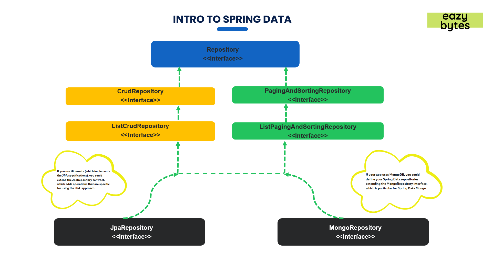

# 📘 Spring Boot, JPA & Hibernate - Zero to Mastery (Course Practice)

This repository contains my practice code and mini projects from the Udemy course:  
**[Spring, Spring Boot, Spring Data JPA & Hibernate - Zero to Mastery](https://www.udemy.com/course/spring-springboot-jpa-hibernate-zero-to-master/?kw=master+spring+6&src=sac&couponCode=LETSLEARNNOW)**

## 🚀 What I'm Learning

- Core Spring Framework concepts
- Spring Boot auto-configuration and structure
- Dependency Injection and Inversion of Control (IoC)
- Spring Data JPA and Hibernate ORM
- Entity relationships (OneToOne, OneToMany, ManyToMany)
- Query methods and JPQL
- Transactions, EntityManager, and repositories
---

# **Core Spring Framework concepts:**
# **• Spring Core:** 
 - The :heart: of the entire spring. <br />
 - Contains Base framework classes, principles and mechanisms. <br />
 - Spring framework and other projects are built on top of "Spring Core". <br />
 - Contains importent components:  <br />
 1. ```IOC``` (Inversion of control): [Principal/Concept] &rarr; A software design concept where the control of object creation and their dependency management is inverted from the program (developer) to a framework/container. <br />
 2. ```DI``` (Dependency Injection): [Implementation Pattern] &rarr; Design pattern used to implement IoC by allowing the injection of a class's dependencies from outside (by the IoC container) rather than the class creating them itself. <br />
 3. ```Beans``` : - Normal Object/ POJO (plain old java object) &rarr; Created and managed by "IOC Container". <br />
 - Defined using config. metadata (XML Config or Annotation). <br />
 4. ```IOC Container```: [Spring Factory] &rarr; Container that: 1- creates beans 2- Manage their lifecycle 3- Injects dependency (via DI). <br />
   - Types: <br />
   1- ```Bean Factory``` &rarr; Lazy initialization. <br />
   2- ```Application Context``` &rarr; More advanced (used is most spring apps). <br />
 5. ```Context ``` (Application Context) : [Spring Brain] &rarr; advance version of IOC Container. <br />
   - Extra features: International support, Event propagation, AOP integration, Easier access to environ./ config. <br />
 6. ```SpEl ``` (Spring Expression Language): Let you write small expressions inside annotations or XML to (Access Values/ Call Methods/ do math). <br />
   ``` @Value("#{2 + 3}") ``` or ```@Value("#{myBean.someMethod()}") ``` &rarr; ```#``` is used to reference beans, methods, or expressions. <br />
  ``` @Value("${app.name}")```  &rarr; ``` $``` Gets value from application.properties. <br />

___

 # **:electric_plug: Spring Data (From JDBC to Spring Data JPA):**
```✅ Persistence Layer``` &rarr; Layer that (we write all the code related) is responsible for all `database interactions` (CRUD operations) inorder to fetch records. <br />
- Traditionally, developers had to manually: <br />
1- Write SQL statements. <br />
2- Set query parameters. <br />
3- Iterate over results using a RowMapper (JDBC template style). <br />
```✅ Spring Data``` &rarr; Implements all the hibernate specifications + help of hibernate framework to make developer's life much easier.<br />
- `Parent project` that simplifies database operations. <br />
- Contains `sub-projects` like Spring Data JPA, Spring Data MongoDB, etc.<br />
- Automates repetitive database code using `repositories` and `annotations`.<br />

```✅JPA (Java Persistence API)``` &rarr; [Specification/interface that uses the hibernate, not an implementation]
- Defines standard `rules` and `annotations` for ORM, but it does not provide an implementation.<br />
- Describes how to `map` Java `objects` to database `tables` (ORM) Object Relational Mapping.<br />
- Defines `relationships`, `caching`, `lazy loading`, and more.<br />

```✅ Hibernate``` &rarr; [Popular Implementation for JPA]<br />
- The 1st and most popular ORM framework that inspired that inspired the Java EE (now Jakarta EE) team to to develope JPA.<br />
- Handles `SQL generation`, `entity management`, and `advanced ORM features`.<br />

```✅ MyBatis``` &rarr; [Not a full ORM]<br />
- You write your `SQL Manually` ( which gives you full control over sql statement)<br />
and MyBatis `maps` the `results` to `Java objects` automatically.<br />
- So it sits between JDBC and Hibernate:<br />
- `More flexible` than Hibernate (you control SQL).<br />
- `Less manual` work than JDBC (automatic object mapping).<br />


```✅ JDBC``` &rarr; [low-level database API / Not a ture ORM]<br />
- You manually manage SQL, connections, and result mapping.<br />
- Considered a mini/ limited ORM, because it doesn't handle object relationships or entity state.<br />

```
         Abstraction Level ↑
       
           ┌────────────────────────────┐
           │       Spring Data          │  ← Simplifies everything via interfaces
           └────────────────────────────┘
                     ▲
           ┌────────────────────────────┐
           │         JPA API            │  ← Defines ORM rules and specifications [Interface]
           └────────────────────────────┘
                     ▲
           ┌────────────────────────────┐
           │        Hibernate           │  ← Implements JPA, handles SQL/ORM logic [Implementation]
           └────────────────────────────┘
                     ▲
           ┌────────────────────────────┐
           │     MyBatis / JDBC         │  ← Lower level, manual SQL (JDBC), 
           │                            │     SQL mapping (MyBatis)
           └────────────────────────────┘

```
___
#  **✅ Build Tools in Java/Spring Boot:**
- `Automate` `tasks` like &rarr;
 `compiling`, `packaging` (jar/war), and `managing dependencies` (External libraries), running `tests` and `deploy` apps.

- Build tools:<br />
1- `Maven` is easier to understand but verbose (more detailed than necessary).<br />
2- `Gradle` is faster and more flexible, but needs more initial learning.<br />

###  **🚀 Maven vs Gradle: Summary:**

| Feature                   | Maven                                            | Gradle                                                 |
| ------------------------- | ------------------------------------------------ | ------------------------------------------------------ |
| **Build File Format**     | XML (`pom.xml`)                                  | Groovy or Kotlin (`build.gradle` / `build.gradle.kts`) |
| **Syntax**                | Verbose, declarative                             | Concise, script-like, flexible                         |
| **Performance**           | Slower (`no caching` or `parallel build` by default) | Faster (uses `caching`(no rebuild for unchanged things), `incremental`(builds only new changes) and `parallel builds`) |
| **Learning Curve**        | Easier for beginners                             | Steeper, requires scripting knowledge                  |
| **Customization**         | Limited (based on plugin and XML structure)      | Highly customizable with scripting logic               |
| **Build Output**          | Fixed (`target/`)                                | Configurable (`build/` by default)                     |
| **Plugin Ecosystem**      | Mature and widely supported                      | Modern and very flexible (especially for android)                               |
| **Tooling Support**       | Excellent (supported in all major IDEs)          | Excellent, especially strong for Android               |
| **Dependency Management** | Uses Maven Central                               | Uses Maven Central and other repositories              |
| **Community**             | Large, well-established                          | Growing fast, widely adopted in modern projects        |


___
 # **✅ Custom Validations:** 
- Custom annotations (example: Email and password confirmation, refuse weak passwords)<br />
- Steps:<br />
  1- `@Interface`.<br />
  2- class implements `ConstraintValidator interface` & override `isValid()` method.<br />
  3- using `Annotation` on fields inside POJO class.<br />


 -  **✅Validation Annotations: `@Valid` vs `@Validated`**: <br />


| Annotation  | Group Support | Use Case |
|-------------|----------------|---------|
| `@Valid`    | ❌ No           | Applies **all constraints unconditionally** &rarr; for **simple validation** (no grouping). |
| `@Validated`| ✅ Yes          | Supports **validation groups** (e.g., `OnCreate`, `OnUpdate`) &rarr; when you need **different validation rules**. |

#### Example:
```java
// Using validation group for update only
@Validated(OnUpdate.class)
public String updateProfile(@ModelAttribute("profile") ProfileDTO profileDTO) {
    // ...
}
```
___

 # **🔒 Spring Security:** 
 - :zap: Powerful ```Authentication``` & ```access-control``` framework. <br />
 - With a minimum of configuration, it provides ```Authentication``` & ```Authorization``` & ```Protection``` against common attacks (CSRF , CORs) (Cross-Site Request Forgery, Cross-Origin Resource Sharing) using out of the box features. <br />
 - Good integration with ```Authentication providers``` as: JWT (Java web access token), OAuth2 and LDAP. <br />
 - Dependency:
   ```
  	<dependency>
			<groupId>org.springframework.boot</groupId>
			<artifactId>spring-boot-starter-security</artifactId>
		</dependency>
   ```

-  **Spring Security Functions**: <br />

| Method        | Purpose                                                                                                                                          | 
|---------------|--------------------------------------------------------------------------------------------------------------------------------------------------|
| `defaultSecurityFilterChain()` | Define `custom security rules` and override default Spring Security behavior[Define it as a `@Bean` in a `@Configuration` class]|
| `permitAll()` | Allow access to everyone `without security login` [Public APIs, Paths, CSS, Images, JS files ...]                                                |
| `denyAll()`   | Deny access to everyone used to `retire` a specific API temporarily with out removing the code [Testing Purposes]                                |

___
 # **:trophy:Spring Annotations :** 

| Annotation | Description |
|------------|-------------|
| `@Component` | Enables Spring to `auto-detect` and `register` the class as a Spring `bean`. |
| `@Controller` | Marks a class as a web `request handler`. |
| `@RestController` | Combines `@Controller` and `@ResponseBody` to simplify REST API controllers. |
| `@RequestMapping("app/v1/")` <br> `@RequestMapping(method = RequestMethod.GET, value = "/{topicId}/courses")` | Maps HTTP requests to handler methods or classes. |
| `@PathVariable` | Binds URI template variables to method parameters. |
| `@RequestBody` | Binds the body of the HTTP request to a method parameter. |
| `@Service` | Indicates a class contains `business logic`. A specialized form of `@Component`. |
| `@Repository` | Marks a class as a `DAO` that handles data access logic. Also a specialized `@Component`. |
| `@Entity` | Specifies that the `class` is an entity mapped to a `database table`. |
| `@Table` | Specifies the name of the database table for the entity (use when class name and the actual table name in the database are different). |
| `@Column` | Customize the `mapping` between entity `field` and a database `column`. |
| `@Transient` | Excludes a field from persistence/ Not mapped into a column in database (communicate to JPA not to consider this field in any db related operations insert/update/delete/..) useful for calculated or temporary fields (e.g., age, confirmPassword). |
| `@Id` | Defines the primary key of an entity. |
| `@GeneratedValue` | Configures the strategy for generating primary key values. |
| `@GeneratedValue(strategy = GenerationType.IDENTITY)` | Tells JPA to delegate the ID generation to db using an AUTO_INCREMENT column.(works perfectly with MySQL databases) |
| `@GeneratedValue(strategy = GenerationType.SEQUENCE, generator = "employee_seq") <br> @SequenceGenerator(name = "employee_seq",           // Generator name used in @GeneratedValue<br> 
sequenceName = "employee_seq",   // Actual sequence name in PostgreSQL<br> 
allocationSize = 1               // Optional: 1 = get a new value every time (no caching))` | Defines the mapping between the entity and the PostgreSQL sequence. SEQUENCE or TABLE strategies (those are used with databases like PostgreSQL, Oracle, etc.) |
| `@Value("${CONFIG_VAL:Default}")` <br> `@Value("#{systemProperties['java.home']}")` | Injects values from environment variables or Spring Expression Language (SpEL). |
| `@ManyToOne` + `@JoinColumn(name = "column_id")` | Maps a many-to-one relationship and defines the foreign key column. |

> 💡 **Note**: `@Service` and `@Repository` are specialized types of `@Component` used to clarify the role of the bean in the application layer.


___
 # **:arrows_clockwise:	Sorting:** 
 - Before JPA we used to sort manually in sql ```Order By```.
 - Spring ```Data JPA``` sorts the query result with ```Easier Configs```.
 - Provides default implementation of sorting with the help of ```PaginationAndSortingRepository```.

 **:two: Ways Of Sorting**:

 1- ```Static Sorting```: Retrieved data always sorted by **specified** **columns** and **directions** at **development time** and can't be changed at **runtime**.</br>
The **default** sort direction is "asc", You don’t have to clearly write out "asc" (Optional).

 ```java
  List<Person> findByOrderByNameDesc();
 ```
 2- ```Dynamic Sorting```: More **flexible** where you can choose sorting **column** and **direction** at **runtime**. </br>
 **Sort parameter** to **query method** [Sort Class]
 ```java
Sort sort = Sort.by("name").ascending();
coursesRepository.findAll(sort);
 ```
 # **:page_with_curl:	Pagination:** 
 - Spring ```Data JPA``` also supports pagination which helps easier to ```manage``` & ```display``` & ```understand``` ```large amount of data``` in various pages.
 - **Special paramter** (like sorting) called **pageable (interface)** combines both ```Pagination``` & ```Sorting```. 

**&rarr; Dynamic Sorting**: 
 ```java
Pageable pageable = (Pageable) PageRequest.of
(pageNum-1, /* 1st page starts at */
 pageSize,  /* no. of pages */
  sortDir.equals("asc")? Sort.by(sortField).ascending() : Sort.by(sortField).descending());

 Page<Contact> contactMsgs = contactRepository.findByStatus(EazySchoolConstants.OPEN,pageable);
 ```
 **Structure before spring-data-jpa(3.x)**: 

- Old (`CrudRepository`, `PagingAndSortingRepository`):
  - `saveAll(...)` → Iterable<T>
  - `findAll()` → Iterable<T>

 ```
 Repository
   ↑
CrudRepository
   ↑
PagingAndSortingRepository
   ↑
JpaRepository
 ```

**Structure In the new (3.x) version of spring-data-jpa(3.x)**: 
#### 🔁 Evolution of Return Types
- New (`ListCrudRepository`, `ListPagingAndSortingRepository`):
  - `saveAll(...)` → List<T>
  - `findAll()` → List<T>

 ```               
               Repository (marker interface)
            ↑                                ↑
     CrudRepository              PagingAndSortingRepository
            ↑                                ↑
 ListCrudRepository          ListPagingAndSortingRepository (deprecated in 3.1)
            \____________________  ____/
                                ↓
                         JpaRepository
 ```


.jpg)

- **CrudRepository** &rarr; provides ```CRUD functions```.
- **PagingAndSortingRepository** &rarr; provides ```methods``` to do ```pagination``` and ```sorting``` records.
- **JpaRepository** &rarr; provides some ```JPA-related methods``` such as ```flushing``` the persistence context and ```deleting``` records in a batch.

___
 # **:cloud: Amazon Web Services (AWS) :** 
 - `DB deployment`: `1- Local Deployment` (on PC) or `2- Cloud Deployment` (AWS, GCP, Azure, etc)
 - `Amazon RDS` (Relational Database) is a `managed service` that makes it easy to set up, operate, Secure, reliable, and scale a relational database in the `cloud`. <br />
 - Free Tier Tip: Start and stop the DB only when using it to stay within free tier limits.<br />
 - Auto Restart Every 7 Days: AWS restarts stopped DBs weekly for backup. Delete the instance if you're not using it to avoid surprise charges.<br />
 - `Endpoint`: The `URL` used to `connect` your web app to the RDS database.<br />
 - `Port`: Default MySQL port is `3306`.<br />

**• 🧩 SQL Client (SQLectron):** - `Lightweight` alternative to MySQL Workbench or full MySQL server.<br />
  				- `Easy setup` to connect to SQL databases.<br />

**•🔐 Security Groups (Firewall for AWS Resources):** <br />
- `Outbound Rules`: Allow DB to send traffic out `(AWS → World)`. Usually set to "allow all (All traffic)"
- `Inbound Rules`: Allow external sources to reach the DB `(World → AWS)`.

**•🌍 IPv4 vs IPv6 :** <br />
- `IPv4`: Older, more common. Example: 192.168.1.1 <br />
- `IPv6`: Newer, longer format. Example: 2001:0db8:85a3::8a2e:0370:7334 <br />
___

 # **:herb: Thymeleaf:** 

**-🛠️ Static Resources Tip:** <br />
- If static files (CSS/JS) aren’t loading  → make sure to use a `"/"` at the beginning of the path in href `(e.g., href="/assets/css/style-starter.css")`. <br />


